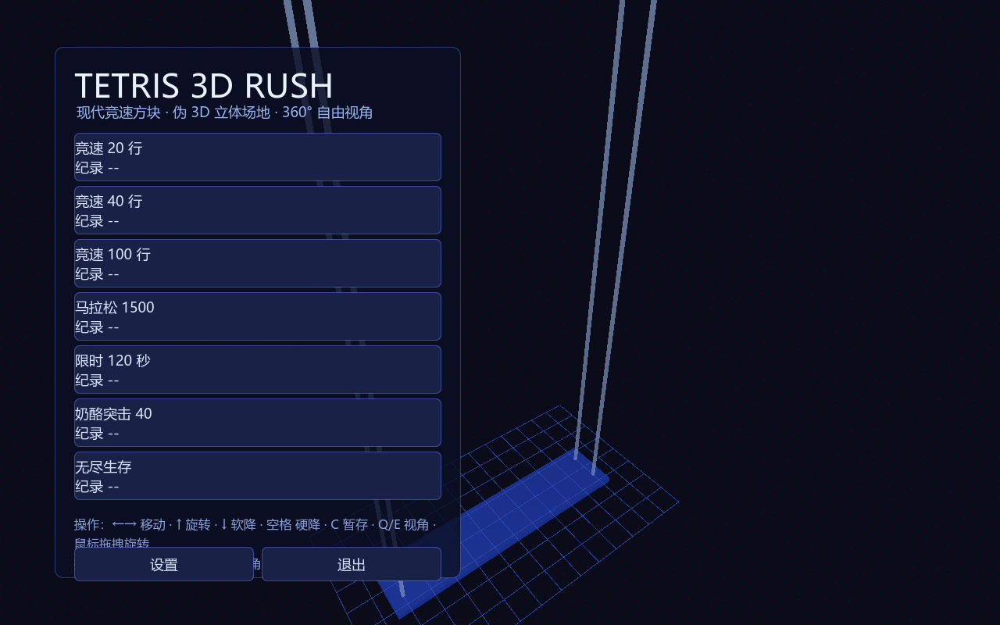
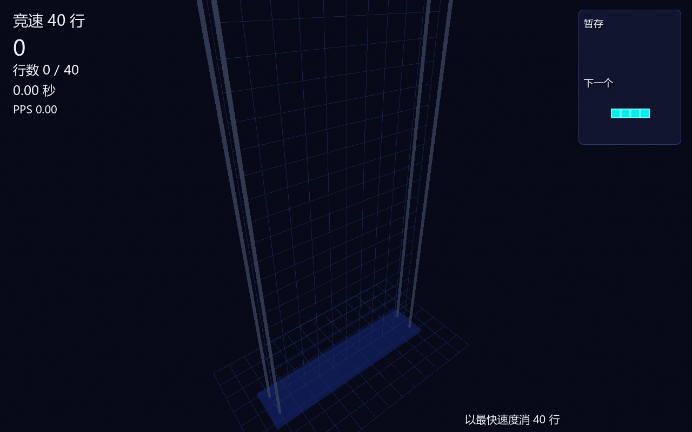

# Tetris 3D Rush 现代竞速方块

**Godot 4.3 重制版** · 伪 3D 立体场地 · 360° 自由视角 · 七种竞速模式

> 使用 Godot 4.3（免费开源引擎）从零重制的现代竞速俄罗斯方块。场地为可 360° 环绕观察的「竖直晶碑」3D 立体棋盘，支持多种方块材质、多套动态背景与自定义背景图上传，玩法对标现代俄罗斯方块（SRS 踢墙、7-bag、暂存、幽灵块、连击 / B2B / T 旋计分）。

---

## 下载 Windows 版

一键下载即玩（免安装，解压后双击 `Tetris3DRush.exe`）：

[](https://github.com/T720Dsh/Tetris/releases/latest)

## 特性

- **伪 3D 立体场地**：10×22 竖直晶碑棋盘，方块立体凸起，光影随视角变化
- **360° 自由视角**：鼠标拖拽旋转、滚轮缩放、Q/E 旋转、V 复位、F 正面视角；主菜单自动环绕展示
- **7 种竞速模式**（统一 `MODE_CFG` 配置驱动）：
  - 竞速 20 / 40 / 100 行（Sprint）
  - 马拉松 1500（限时 15 分钟 + 10 层开局垃圾行）
  - 限时 120 秒（Blitz 速推）
  - 奶酪突击 40（5 列 40 行垃圾 + 松键立即锁定）
  - 无尽生存（每 100 行 +1 秒重力，死亡即止）
- **6 套方块材质**：霓虹 / 水晶 / 金属 / 像素 / 糖果 / 流光
- **5 套背景主题 + 自定义**：深蓝 / 星云 / 城市 / 极光 / 赛博网格，支持上传本地图片作为全景背景
- **现代规则**：SRS 踢墙、7-bag 洗牌、暂存（Hold）、幽灵块、连击 / Back-to-Back / T 旋 / 全清计分
- **可调重力速度**：极慢 / 慢 / 标准 / 快 / 极快
- **键位重绑**：任意按键自由定制（点击后按下新键）
- **音效**：程序合成（消行 / T 旋 / 连击 / 纪录）
- **本地纪录**：每种模式独立纪录，存档写入 exe 旁的 `user_data` 目录（不污染系统盘）

## 操作

| 动作 | 按键 |
| --- | --- |
| 左 / 右移动 | ← / →（含 DAS/ARR） |
| 旋转（顺时针 / 逆时针 / 180°） | ↑ / Z / A |
| 软降 | ↓ |
| 硬降 | 空格 |
| 暂存 | C |
| 暂停 | ESC |
| 重开 | R |
| 视角旋转 | Q / E，或鼠标拖拽 |
| 视角复位 / 正面 | V / F |
| 缩放 | 鼠标滚轮 |

## 界面预览

| 主菜单 | 对局 |
| --- | --- |
|  |  |

## 从源码构建（Windows）

需要：Godot 4.3 标准版（[下载](https://godotengine.org/download/)）+ 导出模板。

```
git clone https://github.com/T720Dsh/Tetris.git
# 用 Godot 编辑器打开 project.godot，或命令行：
godot --headless --path . --export-release "Windows Desktop" build/Tetris3DRush.exe
# 或直接运行仓库内的打包脚本（自动导出 exe + 生成 zip）：
build_exe.bat
```

构建后产物：`build/Tetris3DRush.exe` 与 `build/Tetris3DRush-win64.zip`。

## 运行逻辑自测

```
godot --headless --path . --script res://tests/test_logic.gd
```

覆盖：7-bag、移动 / 旋转、硬降、锁定、消行计分、T 旋判定、暂存、Game Over。

## 技术说明

- 引擎：**Godot 4.3**（MIT 许可，免费开源，无任何商业限制）
- 渲染：Forward+（Vulkan），棋盘方块由程序化 ArrayMesh 合并 + 自定义着色器（自发光 / 幽灵脉冲）
- 逻辑与渲染分离：`board_logic.gd` 纯逻辑（可单测），`board_3d.gd` / `background_3d.gd` / `ui_*.gd` 负责 3D 与界面
- 项目结构：
  ```
  project.godot        项目配置（含键位定义）
  scenes/main.tscn     根场景
  scripts/             逻辑 + 渲染 + UI + 设置
  tests/test_logic.gd  逻辑自测
  export_presets.cfg   导出配置
  build_exe.bat        一键打包脚本
  ```

## 致谢

玩法规则参考现代俄罗斯方块标准（SRS / 7-bag 等）。项目完全独立实现，未使用任何第三方素材或代码库。

---

[GitHub 仓库](https://github.com/T720Dsh/Tetris) · [Releases](https://github.com/T720Dsh/Tetris/releases)
